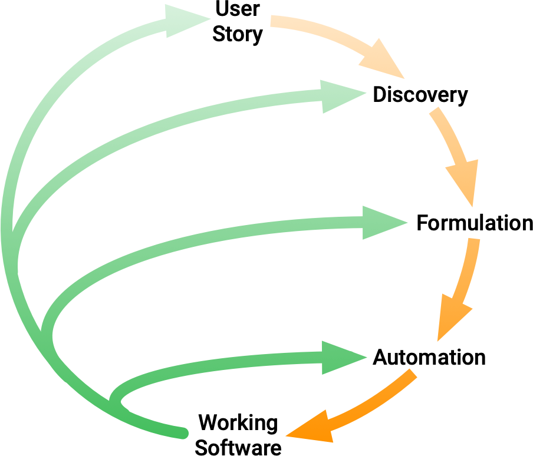

# Behavior-Driven Development Guide

Software development process that helps to build a shared understanding of the business requirements through
collaboration between domain experts and software engineers.

BDD is a way for software teams to work that closes the gap between business people and technical people by encouraging
collaboration across roles to build a shared understanding of the problem to be solved.

